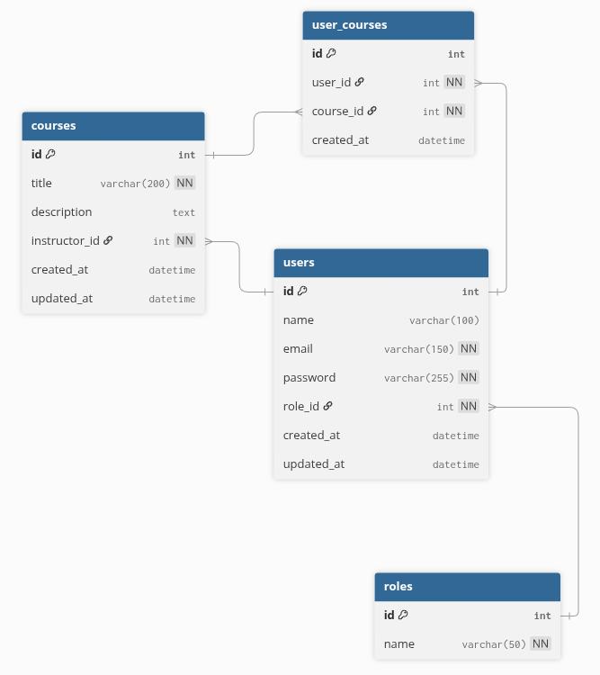

## 🚀 API para gerenciamento de cursos

### 📄 Descrição do Projeto

Esta API/Aplicação foi desenvolvida como parte do projeto da disciplina Tópicos Especiais e tem como escopo principal um sistema básico de cadastro de cursos. O backend oferece endpoints RESTful para CRUD e utiliza o **TypeORM** para persistência de dados em um banco de dados **MySQL**.

---

#### Pré-requisitos

Para rodar o projeto localmente, você precisará das seguintes ferramentas instaladas:

* **[Docker](https://docs.docker.com/)** & **[Docker Compose](https://docs.docker.com/compose/):** Necessário para subir o ambiente da aplicação e do banco de dados (MySQL).

---

### ⚙️ Instruções de Execução Local

- Primeiramente, crie um arquivo .env com base no .env.example que contenha as seguintes variáveis:

```
# Configurações de Conexão com o Banco de Dados (Docker)
DB_HOST=db             # Nome do serviço Docker
DB_PORT=3306
DB_USER=nestjs_user
DB_PASSWORD=nestjs_password
DB_NAME=nestjs_db

# Variáveis de Segurança (JWT)
SECRET_KEY=[UMA CHAVE SECRETA LONGA E COMPLEXA]
```

Rodando o projeto:
```bash
docker-compose up --build
```

Parando o projeto
```bash
docker compose down
```

### 🗺️ Diagrama de Entidade-Relacionamento (ERD)



### ✅ Checklist de Funcionalidades

Autenticação e Autorização
- [x] Cadastro de Usuário (Sign Up)
- [x] Autenticação com JWT (Sign In)
- [x] Logout (Sign Out / Invalidação do token no cliente)
- [ ] Guards de Autorização baseados em Roles (ADMIN, USER)

Módulo de Usuário
- [x] Listagem de Usuários com Paginação e Filtro por Nome.
- [x] Busca de Usuário por ID.
- [x] Edição de Usuário (Update).
- [x] Exclusão de Usuário (Delete).

Módulo de Cursos
- [ ] Listagem de Cursos com Paginação e Filtro por Nome.
- [ ] Busca de Curso por ID.
- [ ] Edição de Curso (Update).
- [ ] Exclusão de Curso (Delete).

Outras Funcionalidades
- [x] Padrões de Retorno de API (Interceptors).
- [x] Padronização de Exceções (Exception Filters).

**Criado por:** Rian Custódio de Souza Beltrão